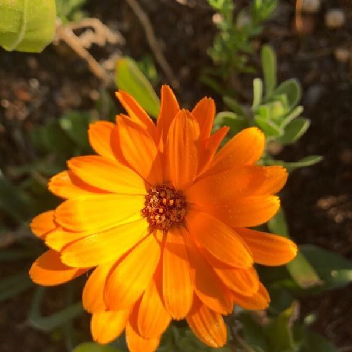
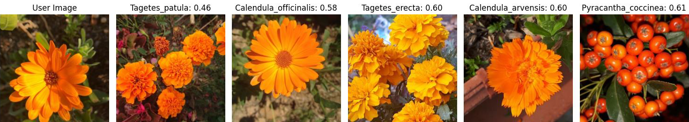
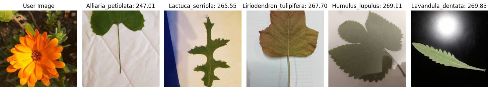

# Unsupervised Plant Species Identification 🌿

This repository contains code for analyzing plant images using **unsupervised machine learning** and **image similarity measures**.

The goal of the project is to **analyze and compare unsupervised learning methods and image–quality measures** in the context of **plant species identification**. The work focuses on:

- clustering algorithms: **Hierarchical Clustering Analysis (HCA)** and **density-based clustering (DBSCAN)**  
- image descriptors: **HSV color space** and **SIFT**  
- image similarity measures: **MSE** and **SSIM**

The aim is to understand how these approaches and measures can be combined to obtain useful results for automatic plant species identification.

---

## 📂 Project structure

```text
.
├─ src/
│  ├─ main_mse_ssim.py   # baseline similarity search using pixel-space MSE and SSIM
│  ├─ hca_hsv.py         # hierarchical clustering (HCA) in HSV color space
│  ├─ hca_sift.py        # HCA using SIFT descriptors
│  ├─ dbscan_hsv.py      # DBSCAN-style neighbourhood analysis in HSV space
│  └─ dbscan_sift.py     # DBSCAN-style neighbourhood analysis with SIFT
├─ requirements.txt      # Python dependencies
├─ .gitignore
└─ README.md
```

---

## 🧪 Methods

### Image descriptors

#### HSV color model

* Images are converted from **BGR to HSV**.
* A **3D histogram (H×S×V)** is computed and flattened into a feature vector.
* This descriptor captures **color distribution**, but **not shape or texture**.

#### SIFT (Scale-Invariant Feature Transform)

* Local **keypoints** and **feature descriptors** are extracted.
* Images are compared by **matching descriptors** and aggregating distances.
* Focuses on **local structures and edges**, and is **robust to scale and rotation**.

---

### Similarity measures (baseline)

Implemented in `src/main_mse_ssim.py`:

#### MSE (Mean Squared Error)

* Simple **per-pixel squared error** between two resized images.

#### SSIM (Structural Similarity Index)

* A more **perceptual** measure that considers local **luminance, contrast and structure**.

The baseline script loads a **user image** and searches the dataset for the most similar plant image according to **MSE** and **SSIM**.

---

### Unsupervised clustering / neighbourhood search

#### Hierarchical Clustering Analysis (HCA)

* Computes **pairwise distances** between feature vectors (HSV or SIFT).
* Builds a **dendrogram** (Ward linkage).
* The **cluster containing the user image** is inspected to see which species are most similar.

#### DBSCAN-style analysis

* Extracts features per image (HSV or SIFT).
* Uses **density-based ideas** to identify neighbourhoods around the user image in feature space.
* Shows the **top neighbours** as the most similar plants.

---

## 🌱 Dataset: Pl@ntNet-300K

Experiments are based on the **Pl@ntNet-300K** dataset, which consists of three splits:

* `train`
* `test`

In this project:

* The **test split** is used as the main pool of images for analysis.
* To keep runtime reasonable, a **random subset of more than 6,000 images** was selected from the test set — about **15%** of its total size.
* This subset is a compromise between **result quality** and **computation time**.

---

## 🔬 Experimental setup

* **Dataset**: Pl@ntNet-300K, test split.
* **Subset**: > 6,000 images (~15% of test set), sampled randomly for efficiency.
* **Preprocessing**: input images are resized / normalized inside the scripts.
* **Test images**: three representative images were analyzed:

  1. High number of details, high contrast, low diversity
  2. Medium details, medium contrast, medium diversity
  3. Low details, low contrast, low diversity

The summaries below focus mainly on the **first image**, for which the methods behave most clearly, and on qualitative behavior for the remaining images.

---

## 📊 Selected quantitative result

### Image 1 – many details, high contrast, low diversity

*A bright orange **Calendula officinalis** flower on a darker background.*



#### MSE (pixel space)

* **Most similar plant image**: *Calendula officinalis*
* **Similarity (MSE value)**: `87.79`
* **Interpretation**: for this type of image, MSE successfully identifies the correct species.

#### SSIM

* **Most similar plant image**: *Calendula officinalis*
* **Similarity (SSIM value)**: `0.4109`
* **Interpretation**: SSIM also points to the correct species on this example.

---

## 🧾 Method-by-method summary of results

### MSE – Mean Squared Error

**Works best for images with:**

* a high number of visual details,
* high contrast,
* a single, clearly visible main object.

**Behaviour on different images:**

* For **medium** details / contrast / diversity, MSE sometimes returns an **incorrect species but of the same genus**.

  * These species share many morphological characteristics (flower and leaf shape), so the mistake still reflects real visual similarity.
* For **low** details, low contrast, and low diversity (e.g. mostly flat green leaves), MSE produces results that **disagree with human visual intuition**.

**Pros**

* Very simple and **computationally cheap**.

**Cons**

* Purely pixel-based – **does not model human perception**.
* Two images can have similar MSE but look very different to a person.

---

### SSIM – Structural Similarity Index

* Uses local patterns such as **edges and textures**, which are important for the human visual system.

**In this project:**

* Performs best on images with **many details, high contrast and low diversity** (image 1).
* Fails to produce correct or intuitive results for the **other two test images**.

**Likely reason:**

* SSIM focuses on **local structures**, making it less sensitive to **global changes** in brightness and contrast.
* For the other images these global differences are small, leading to **ambiguous scores**.

Despite being more computationally complex than MSE, **SSIM does not provide better results** for plant photos in this setting.

---

### Hierarchical Clustering (HCA) in HSV color space


**Works well when the plant:**

* clearly stands out from the background,
* has a distinctive and saturated color.

For the first test image (bright orange flower on dark background), HCA groups the user image with flowers of **similar morphology and color** (e.g. *Calendula* and *Tagetes* species with large yellow–orange flowers).

This shows that HSV can be effective when **color is a strong discriminative feature**.

**Limitations**

* Sensitive to changes in **illumination** – the same color may map to different HSV values under different lighting conditions.
* Ignores **shape and texture**, so for example:

  * purple flowers and purple leaves can be treated as similar due to color only,
  * scenes dominated by green are hard to distinguish because many plants share similar green backgrounds.

---

### DBSCAN-style analysis in HSV space

Overall, this method produced results **closest to human perception** among the unsupervised approaches tested.

**For the first test image:**

* The **top-1 species** is not always correct,
  but the **top four matches** are flowers from the *Calendula* and *Tagetes* genera, which share very similar floral morphology.
* The **fifth match** differs in shape but appears because of a similar **color distribution**, illustrating HSV’s focus on color rather than structure.



**Conclusion**

* Even when exact species identification fails, the ranking often **correlates with human judgments of visual similarity**.

---

### Hierarchical Clustering (HCA) with SIFT descriptors

* Results **deviate strongly from human perception**.
* The dendrogram tends to show only those species that share **many SIFT keypoints** with the user image, while omitting other visually similar species with fewer keypoints.

**Likely reason:**

* SIFT focuses on **local structural features** which may be sparse or not distinctive in many plant images (smooth leaves, uniform petals).

As a result, the clustering does **not reflect intuitive botanical similarity**.

---

### DBSCAN-style analysis with SIFT descriptors

* Also performs **poorly** for plant images.
* SIFT emphasizes **shapes and textures**; plant images often lack strong, unique structural features beyond general leaf/flower outlines.

Background structures (soil, bark, textured backgrounds) may be detected as keypoints:



* In some examples, **soil or background** is treated as the key region, and images with similar backgrounds are ranked as most similar, even if the plants themselves are different.

**Conclusion**

* In this setup, **SIFT is not an effective descriptor** for species-level plant comparison.

---

## 🔮 Overall takeaways

* Simple measures like **MSE** can be surprisingly effective for **high-detail, high-contrast** plant images with a clear main object.
* **SSIM**, while more perceptually motivated, does **not** consistently outperform MSE on this dataset.
* Combining **HSV color features** with **DBSCAN-style neighbourhood analysis** yields results most aligned with **human visual perception**, especially when color is the main discriminative cue.
* Methods based on **SIFT (HCA / DBSCAN)** perform poorly in this domain because:

  * many plant images lack distinctive structural keypoints, and
  * background textures can dominate the descriptor.

Overall, the project illustrates how different unsupervised methods and image similarity measures behave on a realistic plant dataset, and highlights the gap between **algorithmic similarity** and **human perception** when comparing images of plants.

---

## 🙏 Acknowledgements

* The authors and maintainers of **Pl@ntNet-300K** for providing the dataset.
* The creators of the algorithms and descriptors used here (HCA, DBSCAN, HSV, SIFT, SSIM, MSE).
* This project was developed as part of an academic study on unsupervised learning and image quality metrics for plant species identification.
